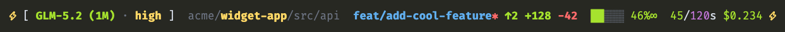
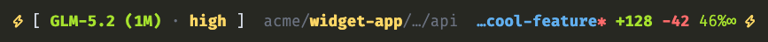

# Claude Code Status Line

A rich status bar for [Claude Code](https://claude.com/claude-code): live model + reasoning effort, repo/pwd, git state, lines changed, context-window usage, time, and cost. Nerd Font glyphs + Powerline arrows, tier-colored, with narrow-terminal compaction. Model-agnostic (Anthropic or z.ai/GLM).



Narrow terminals compact automatically (drops time/cost/context-bar, truncates branch + path):



*Both screenshots use sample/fake data.*

## Install

**A. One-liner (recommended):**
```bash
curl -fsSL https://raw.githubusercontent.com/klh/claude-code-statusline/main/install.sh | bash
```

**B. Claude Code plugin:**
```
/plugin marketplace add klh/claude-code-statusline
/plugin install claude-code-statusline@klh-claude-code-statusline
/install-statusline
```

**C. Manual:**
1. `cp claude/statusLine.sh ~/.claude/statusLine.sh && chmod +x ~/.claude/statusLine.sh`
2. Merge into `~/.claude/settings.json` (don't replace the file):
   ```json
   { "statusLine": { "type": "command", "command": "bash $HOME/.claude/statusLine.sh" } }
   ```
3. Restart Claude Code.

## Requirements
A **Nerd Font** (e.g. `FiraCode Nerd Font Mono`) and **jq**.

## Notes
- Narrow terminals (<110 cols): drops time/cost/context-bar; truncates branch + path.
- One `jq` pass + one `git` call (~40 ms); bash-3.2-compatible. Tweak colors/thresholds in `claude/statusLine.sh`.
- Screenshots are generated from `assets/statusline-*.html` (fake data) — re-render with headless Chrome to refresh.
